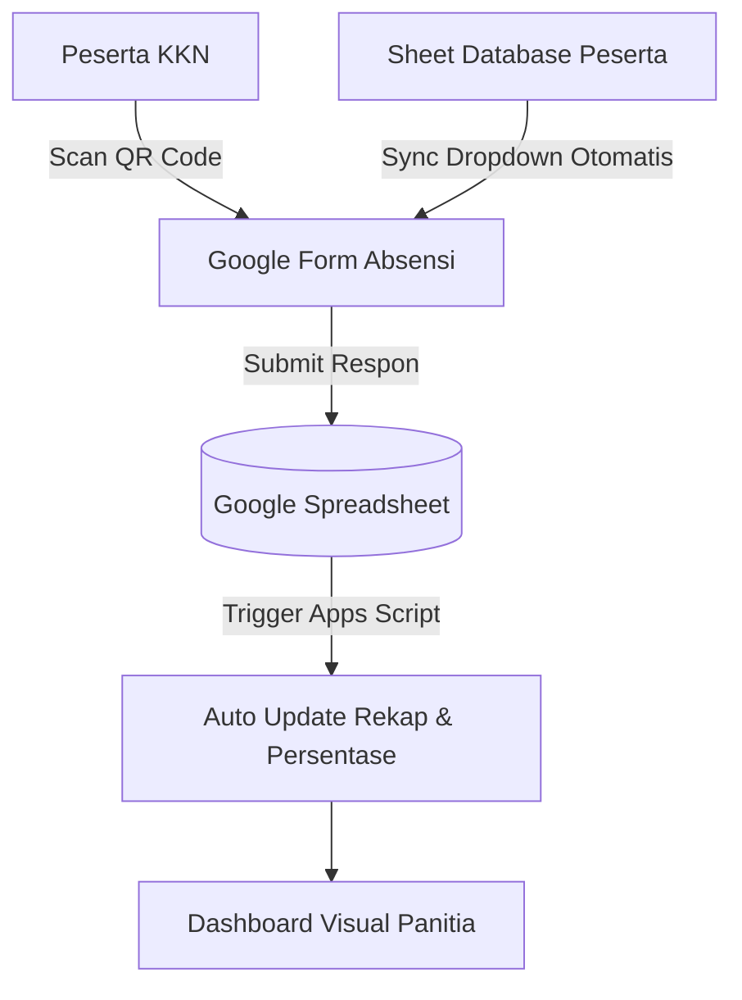

# 📱 PANDUAN LENGKAP SISTEM ABSENSI KKN BERBASIS QR CODE
> **Solusi 100% Gratis, Otomatis, Profesional, dan Mudah Digunakan**
> Menggunakan Google Forms, Google Spreadsheet, Apps Script & Generator QR Code.

---

## 📋 DAFTAR ISI
1. [Arsitektur & Konsep Kerja Sistem](#-arsitektur--konsep-kerja-sistem)
2. [Langkah 1: Membuat Spreadsheet Database Peserta](#langkah-1-membuat-spreadsheet-database-peserta)
3. [Langkah 2: Membuat Google Form Absensi](#langkah-2-membuat-google-form-absensi)
4. [Langkah 3: Menghubungkan Form ke Spreadsheet](#langkah-3-menghubungkan-form-ke-spreadsheet)
5. [Langkah 4: Memasang Automation Google Apps Script](#langkah-4-memasang-automation-google-apps-script)
6. [Langkah 5: Membuat & Mencetak Poster QR Code](#langkah-5-membuat--mencetak-poster-qr-code)
7. [Langkah 6: Alur Operasional (Peserta & Panitia)](#langkah-6-alur-operasional-peserta--panitia)
8. [📊 Tampilan Hasil Absensi & Rekap Dashboard](#-tampilan-hasil-absensi--rekap-dashboard)
9. [🔒 Tips Keamanan, Geolocation (GPS) & Pencegahan Kecurangan](#-tips-keamanan-geolocation-gps--pencegahan-kecurangan)

---

## 🏗️ ARSITEKTUR & KONSEP KERJA SISTEM

Sistem ini bekerja dengan menghubungkan 4 komponen utama:
1. **Google Form**: Formulir input absensi yang diakses peserta via HP.
2. **Google Spreadsheet**: Database pusat penyimpanan data peserta, respon absensi, dan dashboard rekapitulasi.
3. **Google Apps Script**: Mesin otomatisasi untuk menyinkronkan daftar dropdown nama, menghitung persentase kehadiran, dan menandai absen ganda.
4. **QR Code Generator**: Media scan fisik/digital agar peserta langsung masuk ke halaman formulir tanpa perlu mengetik link.



---

## LANGKAH 1: MEMBUAT SPREADSHEET DATABASE PESERTA

1. Buka [Google Sheets](https://sheets.google.com) dan buat **Spreadsheet Baru**.
2. Beri nama file: `Database & Absensi KKN`.
3. Ganti nama tab pertama menjadi: **`Database Peserta`**.
4. Buat tabel header pada **Baris 1** dengan kolom berikut (atau copy-paste dari file **[Database_Peserta_KKN.csv](file:///c:/Users/LOQ/Documents/Qr%20kkn/Database_Peserta_KKN.csv)**):

| No | Nama Lengkap | NIM | Program Studi | Kelompok KKN | Nomor HP |
| :---: | :--- | :---: | :--- | :---: | :---: |
| 1 | Sandy Irham Ramadhani | 231110003585 | Manajemen | Kelompok KKN | 0895412663995 |
| 2 | Nabila Nathania Nafia | 231110003695 | Manajemen | Kelompok KKN | 085867837828 |
| 3 | Ela Indriani | 231110003640 | Manajemen | Kelompok KKN | 087865948676 |
| 4 | Nawa Sabillah | 231110003683 | Manajemen | Kelompok KKN | 089530838336 |
| 5 | Aulia Fatma Sari | 231330001356 | PGSD | Kelompok KKN | 089501655537 |
| 6 | Adina Nisa Alhaq | 231330001417 | PGSD | Kelompok KKN | 087821010226 |
| 7 | Cykha Fadilla Rivanny | 231330001419 | PGSD | Kelompok KKN | 0895360785224 |
| 8 | Diana Atik Susanti | 231330001394 | PGSD | Kelompok KKN | 0895413447807 |
| 9 | Arum Desy Ariyanti | 231240001395 | Teknik Informatika | Kelompok KKN | 081804067087 |
| 10 | Muhammad Syahrur | 231240001362 | Teknik Informatika | Kelompok KKN | 081226545344 |
| 11 | Farel Muhammad Revansa Revikasa | 231210000465 | Teknik Industri | Kelompok KKN | 085866015055 |
| 12 | Adam Dimas Setiansyah | 231120002740 | Akuntansi | Kelompok KKN | 088233167601 |
| 13 | Muhammad Hisyam Annabil Muwaffaq | 231120002678 | Akuntansi | Kelompok KKN | 081226723810 |
| 14 | Aji Jaya Kusuma | 231310005055 | PAI | Kelompok KKN | 085755070965 |
| 15 | Taqiyyatur Rohimah | 231310004951 | PAI | Kelompok KKN | 087845243583 |

> [!TIP]
> **Penting**: Pastikan nama tab persis `Database Peserta` agar Google Apps Script dapat membaca data peserta secara otomatis.

---

## LANGKAH 2: MEMBUAT GOOGLE FORM ABSENSI

1. Buka [Google Forms](https://forms.google.com) dan pilih **Blank Form** (Formulir Kosong).
2. Beri judul formulir: `ABSENSI KEHADIRAN KKN`
3. Deskripsi: *Silakan isi absensi sesuai dengan kehadiran dan kegiatan harian KKN Anda.*
4. Buat pertanyaan-pertanyaan berikut dengan aturan persis:

| No | Judul Pertanyaan | Tipe Pertanyaan | Opsi / Setting | Status Wajib |
| :---: | :--- | :--- | :--- | :---: |
| 1 | **Nama Lengkap** | **Dropdown** | *(Isi 1 nama dummy dulu, nanti otomatis terisi 15 nama di atas via Script)* | **Wajib** |
| 2 | **NIM** | **Jawaban Singkat** | Validasi: Angka | **Wajib** |
| 3 | **Kelompok KKN** | **Jawaban Singkat / Dropdown** | Contoh: *Kelompok KKN* | **Wajib** |
| 4 | **Kegiatan** | **Paragraf** | Jelaskan ringkas kegiatan yang dilakukan | **Wajib** |
| 5 | **Tanggal** | **Tanggal** | Format otomatis tgl/bln/thn | **Wajib** |
| 6 | **Shift** | **Pilihan Ganda** | 🔘 Masuk<br>🔘 Pulang | **Wajib** |
| 7 | **Status Kehadiran** | **Pilihan Ganda** | 🔘 Hadir<br>🔘 Izin<br>🔘 Sakit | **Wajib** |
| 8 | **Keterangan** | **Paragraf** | Alasan jika Izin/Sakit | Opsional |
| 9 | **Upload Foto** | **Upload File** | Izinkan tipe file: Gambar, Maks 10 MB | Opsional |

---

## LANGKAH 3: MENGHUBUNGKAN FORM KE SPREADSHEET

1. Di halaman edit Google Form, klik tab **Tanggapan (Responses)** di bagian atas.
2. Klik tombol hijau **Link to Sheets** (Hubungkan ke Spreadsheet).
3. Pilih opsi **Pilih spreadsheet yang ada (Select existing spreadsheet)**.
4. Pilih Spreadsheet `Database & Absensi KKN` yang dibuat pada Langkah 1.
5. Google Form akan otomatis membuat tab baru di Spreadsheet bernama **`Form Responses 1`**.

---

## LANGKAH 4: MEMASANG AUTOMATION GOOGLE APPS SCRIPT

1. Di Google Spreadsheet Anda, klik menu **Ekstensi (Extensions)** > **Apps Script**.
2. Salin dan tempelkan kode yang ada di file **`Code.gs`** (tersedia di folder proyek ini).
3. Ganti ID Form Anda di baris 11:
   ```javascript
   FORM_ID: 'PASTE_GOOGLE_FORM_ID_DISINI',
   ```
4. Klik tombol **Simpan (💾)** (Ctrl + S).
5. Pilih fungsi `syncNamaDropdown`, lalu klik **Run (Jalankan)** untuk memasukkan 15 nama anggota secara instan ke Google Form!

---

## LANGKAH 5: MEMBUAT & MENCETAK POSTER QR CODE

1. Buka file **`index.html`** atau **`qr_generator.html`** di browser Anda.
2. Salin Link Google Form peserta (Di Google Form klik **Kirim** > **Perpendek URL** > Salin).
3. Buka tab **🖨️ Poster QR Code**, tempelkan link tersebut.
4. Klik **🖨️ Cetak / Simpan PDF** untuk mencetak poster absensi secara instan!

---

## 📊 TAMPILAN HASIL ABSENSI & REKAP DASHBOARD

### Tampilan Tab Rekapitulasi Kehadiran (`Rekap Kehadiran`)
*Otomatis dihitung oleh Apps Script / Web App*:

| No | NIM | Nama Lengkap | Kelompok | Hadir | Izin | Sakit | Total | Persentase (%) | Status Evaluasi |
| :---: | :---: | :--- | :---: | :---: | :---: | :---: | :---: | :---: | :---: |
| 1 | 231110003585 | Sandy Irham Ramadhani | KKN | 10 | 0 | 0 | 10 | **100.0%** | 🟢 Sangat Baik |
| 2 | 231110003695 | Nabila Nathania Nafia | KKN | 10 | 0 | 0 | 10 | **100.0%** | 🟢 Sangat Baik |
| 3 | 231110003640 | Ela Indriani | KKN | 9 | 1 | 0 | 10 | **90.0%** | 🟢 Sangat Baik |
| ... | ... | ... | ... | ... | ... | ... | ... | ... | ... |
| 15 | 231310004951 | Taqiyyatur Rohimah | KKN | 10 | 0 | 0 | 10 | **100.0%** | 🟢 Sangat Baik |

---
*Dibuat khusus untuk Panitia KKN.*
